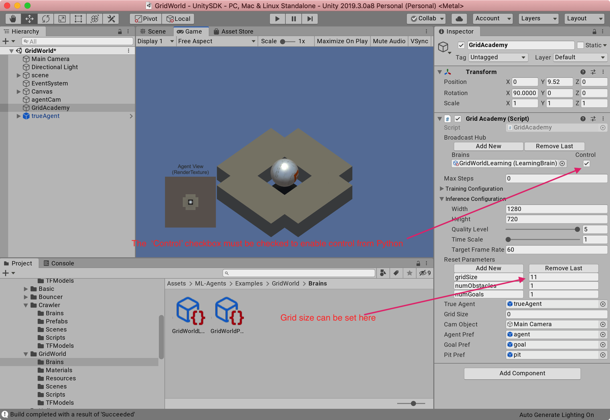

# Running Unity ML-Agents with Python "communicator" wrapper / wamp bridge

## Github project: leela-ai/ml-agents (Currenty on cozy-home)

There is a fork of the Unity ML-Agents project on github, at https://github.com/leela-ai/ml-agents

You *MUST* be running Unity v2019.3.0a8 on OSX (no other versions will work).


ml-agents directory contains a subdir called UnitySDK which is where the Unity project lives. We have modified one of the example games, called GridWorld, to match what Leela's Java grid-world SMS does. 

There's python code in the ml-agents directory which talks to the Unity/C# ML-Agents framework via sockets with some protocol we don't know about. 

## PyCharm Project / create venv with Python 3.6.5 or 3.6.7

We've been using PyCharm, a python IDE from JetBrains, to debug and run python with. It's nice because it has a GUI to set up a python virtualenv, and install any needed libraries.

The .idea directory has the project all set up, but the Python VirtualEnv venv directory is not checked in, so you need to create it.  PyCharm will create it automatically, it can build virtual envs, but Python 3.6 has to be installed someplace on the Mac. 

You need Python 3.6.5 or 3.6.7 installed, This can be done from PyCharm ->  Preferences -> Project Interpreter menu: it will create a virtual env automatically, and you can then select ml-agents package to install.


Then, manually install an local version of Unity "mlagents" python package.
<
% cd ml-agents-envs
% pip3 install -e ./
% cd ..
% cd ml-agents
% pip3 install -e ./

### Toubleshooting 

If you see an error like:

$ pip3 install -e ./
Obtaining file:///Users/maxcarlsonold/leela/ml-agents/ml-agents
    ERROR: Command errored out with exit status 1:
     command: /usr/local/opt/python/bin/python3.6 -c 'import sys, setuptools, tokenize; sys.argv[0] = '"'"'/Users/maxcarlsonold/leela/ml-agents/ml-agents/setup.py'"'"'; __file__='"'"'/Users/maxcarlsonold/leela/ml-agents/ml-agents/setup.py'"'"';f=getattr(tokenize, '"'"'open'"'"', open)(__file__);code=f.read().replace('"'"'\r\n'"'"', '"'"'\n'"'"');f.close();exec(compile(code, __file__, '"'"'exec'"'"'))' egg_info
         cwd: /Users/maxcarlsonold/leela/ml-agents/ml-agents/
    Complete output (5 lines):
    Traceback (most recent call last):
      File "<string>", line 1, in <module>
      File "/Users/maxcarlsonold/leela/ml-agents/ml-agents/setup.py", line 1, in <module>
        from setuptools import setup, find_namespace_packages
    ImportError: cannot import name 'find_namespace_packages'
    ----------------------------------------
ERROR: Command errored out with exit status 1: python setup.py egg_info Check the logs for full command output.


$ pip3 uninstall setuptools
Uninstalling setuptools-39.2.0:
  Would remove:
    /usr/local/lib/python3.6/site-packages/easy_install.py
    /usr/local/lib/python3.6/site-packages/pkg_resources
    /usr/local/lib/python3.6/site-packages/setuptools
    /usr/local/lib/python3.6/site-packages/setuptools-39.2.0-py3.6.egg-info
Proceed (y/n)? y
  Successfully uninstalled setuptools-39.2.0
wafer:ml-agents maxcarlsonold$ pip3 install -e ./
Obtaining file:///Users/maxcarlsonold/leela/ml-agents/ml-agents
    ERROR: Command errored out with exit status 1:
     command: /usr/local/opt/python/bin/python3.6 -c 'import sys, setuptools, tokenize; sys.argv[0] = '"'"'/Users/maxcarlsonold/leela/ml-agents/ml-agents/setup.py'"'"'; __file__='"'"'/Users/maxcarlsonold/leela/ml-agents/ml-agents/setup.py'"'"';f=getattr(tokenize, '"'"'open'"'"', open)(__file__);code=f.read().replace('"'"'\r\n'"'"', '"'"'\n'"'"');f.close();exec(compile(code, __file__, '"'"'exec'"'"'))' egg_info
         cwd: /Users/maxcarlsonold/leela/ml-agents/ml-agents/
    Complete output (3 lines):
    Traceback (most recent call last):
      File "<string>", line 1, in <module>
    ModuleNotFoundError: No module named 'setuptools'
    ----------------------------------------
ERROR: Command errored out with exit status 1: python setup.py egg_info Check the logs for full command output.
wafer:ml-agents maxcarlsonold$ pip3 install setuptools
Collecting setuptools
  Using cached https://files.pythonhosted.org/packages/54/28/c45d8b54c1339f9644b87663945e54a8503cfef59cf0f65b3ff5dd17cf64/setuptools-42.0.2-py2.py3-none-any.whl
Installing collected packages: setuptools
Successfully installed setuptools-42.0.2
wafer:ml-agents maxcarlsonold$ pip3 install -e ./
  ...

See [docs/Installation.md](docs/Installation.md) 

## Building a standalone GridWorld app in Unity




## /leela-agent.py WAMP bridge

The file /leela-agent.py in the top level dir is code which bridges from Leela WAMP SMS protocol to the ml-agents 'communicator' that talks to Unity. 

To run it, activate the venv

```bash
. venv/bin/activate
```

Then run from a shell:

`python leela-agent.py -I`

This will run in 'interactive mode' which means it will wait for you to press "Start" in a running Unity IDE to fire up the Unity GridWorld app

or, if you've built a precompiled Unity GridWorld app, and put it into envs/myhouse.app

`python leela-agent.py -W myhouse`

(NOTE: You must go to a browser and connect to localhost:8080 to start jleela and send events to WAMP/ml-agents)


